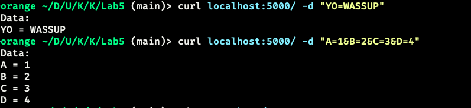

# Компьютерный практикум. Лабораторная работа 5: Взаимодействие веб-сервера с внешними программами. FastCGI, WSGI

### Инструментарий

* Язык программирования Python
* Библиотека Flask

### Код программы

```python
from flask import Flask, request

app = Flask(__name__)

@app.route("/", methods=["GET", "POST"])
def index():
    if request.method == "POST":
        response_text = "Data:\n"
        for name, value in request.values.items():
            response_text += f"{name} = {value}\n"
        return response_text
    else:
        return "Hello!"

if __name__ == "__main__":
    app.run()
```

# Скриншоты 

### GET-запрос


### POST-запрос


