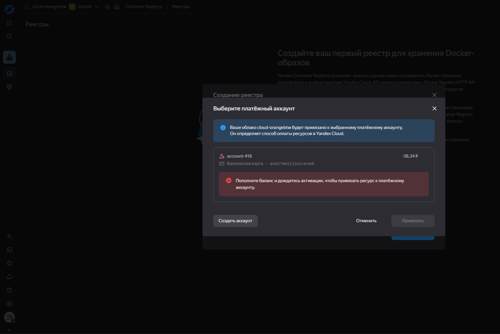

# 📦 Лабораторная работа

## Облачные приложения — Yandex Serverless Applications

---

## 📌 Описание проекта

В рамках лабораторной работы разработано веб-приложение на Python с использованием библиотеки **Pillow** для генерации изображений и фреймворка **Flask**.

Приложение развернуто в среде **Yandex Serverless Containers** и реализует работу с HTTP-маршрутами для генерации, загрузки и отображения изображений.

---

## ⚙️ Используемые технологии

* Python 3.11
* Flask
* Pillow
* Docker
* Yandex Cloud (Serverless Containers)

---

## 🚀 Функциональность

Приложение поддерживает следующие маршруты:

---

### 🔐 `/login`

* **Метод:** GET
* **Ответ:** JSON

```json
{
  "author": "158365"
}
```

---

### 🖼 `/makeimage`

#### GET

Возвращает HTML-страницу с формой:

* width — ширина изображения
* height — высота изображения
* text — текст для отображения

#### POST

* Принимает данные формы
* Генерирует изображение
* Возвращает JPG-файл

#### Валидация:

* width и height должны быть числами в диапазоне 10–2000
* При ошибке возвращается форма с сообщением:

  ```
  Invalid image size
  ```

#### Особенности:

* Цвет фона — светло-серый
* Текст размещается по центру

---

### 📤 `/load_image`

#### GET

Отображает форму загрузки изображения:

* имя файла (опционально)
* выбор файла

#### POST

* Загружает изображение на сервер
* Если имя уже существует — выводится ошибка

---

### 🗂 `/images`

* **Метод:** GET
* Отображает все загруженные и созданные изображения
* Вывод реализован в виде плитки

---

## 🐳 Docker

### Сборка образа

```bash
docker build -t image-app .
```

### Запуск локально

```bash
docker run -p 8080:8080 image-app
```

---

## ☁️ Развертывание в Yandex Cloud

### 1. Авторизация в Container Registry

```bash
docker login cr.yandex
```

### 2. Сборка и загрузка образа

```bash
docker build -t cr.yandex/<registry-id>/image-app .
docker push cr.yandex/<registry-id>/image-app
```

### 3. Создание контейнера

```bash
yc serverless container create --name image-app
```

### 4. Деплой

```bash
yc serverless container revision deploy \
  --container-name image-app \
  --image cr.yandex/<registry-id>/image-app \
  --memory 512M \
  --cores 1
```

> [!WARNING]
> У меня не получилось задеплоить, потому что Яндекс требует оплату для создания контейнера.
> 

---

## 📁 Структура проекта

```
project/
│
├── app.py
├── Dockerfile
└── README.md
```

---

## ⚠️ Важные замечания

* Возврат изображения осуществляется с `Content-Type: image/jpeg`
* Использование base64 **запрещено**
* Валидация входных данных обязательна
* При ошибке отображается HTML-форма с сообщением
* Данные изображений хранятся во временной директории `/tmp/images`

---

## ✅ Проверка работоспособности

После запуска доступны маршруты:

* `/login`
* `/makeimage`
* `/load_image`
* `/images`

